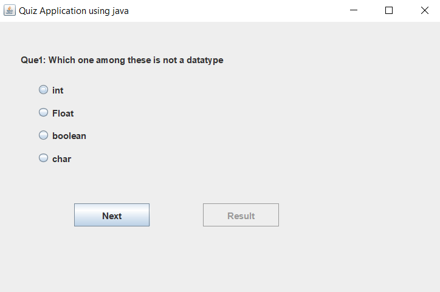

# Java Quiz

## Pre-Requisites 
 - JRE & JDK should be installed
 - Basic Knowledge of Java Swing and AWT

## Library used to make UI:
 - Swing
 - AWT

## How to run:
 - ``javac gui.java``
 - ``java quiz.java``

## Screenshots:

## What's in this:

 - Created the GUI Panel
 - Action Listener to change screen when Next Button is pressed
 - Update the Question and Answer Options Text
 - Checking of Results
 - Print the result in a new Message dialog box.
